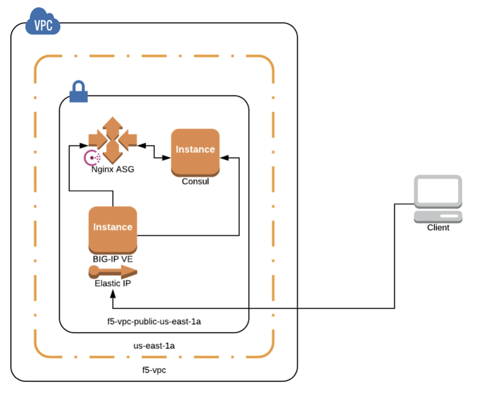

# F5 BIG-IP Terraform & Consul Webinar - Zero Touch App Delivery with F5, Terraform & Consul
- This repository will provision BIG-IP VE (Pay as you Grow), Consul & NGINX servers in AWS

# Architecture


# How to use this repo

- Clone the repository 
- Change directory
```
cd f5-terraform-consul-sd-webinar/terraform/
```
- Run terraform init, terraform plan, and terraform apply
```
terraform init
terraform plan
terraform apply
```
- This will create BIG-IP, consul, NGINX instances on AWS
- Next we need to download and load AS3 rpm into BIG-IP, for AS3 documentation and download please refer to https://github.com/F5Networks/f5-appsvcs-extension
## Install AS3
- Download AS3 version 3.7.0
  - https://github.com/F5Networks/f5-appsvcs-extension/raw/v3.7.0/dist/latest/f5-appsvcs-3.7.0-7.noarch.rpm
- Verify integrity
```
sha256sum f5-appsvcs-3.7.0-7.noarch.rpm
```

Set your environment variables.
```
FN=f5-appsvcs-3.7.0-7.noarch.rpm
IP=$(terraform output F5_IP)
CREDS=admin:$(terraform output F5_Password)
```

Install AS3 using cURL

Upload the package.
```
LEN=$(wc -c $FN | awk 'NR==1{print $1}')

curl -kvu $CREDS https://$IP:8443/mgmt/shared/file-transfer/uploads/$FN \
    -H 'Content-Type: application/octet-stream' \
    -H "Content-Range: 0-$((LEN - 1))/$LEN" -H "Content-Length: $LEN" \
    -H 'Connection: keep-alive' --data-binary @$FN | jq
```
Install the package
```
DATA="{\"operation\":\"INSTALL\",\"packageFilePath\":\"/var/config/rest/downloads/$FN\"}"

curl -kvu $CREDS "https://$IP:8443/mgmt/shared/iapp/package-management-tasks" \
    -H "Origin: https://$IP" -H 'Content-Type: application/json;charset=UTF-8' \
    --data $DATA | jq
```
Go here `curl -ku $CREDS https://${IP}:8443/mgmt/shared/appsvcs/info | jq`. 

You should see something like the following.
```
version	"3.7.0"
release	"7"
schemaCurrent	"3.7.0"
schemaMinimum	"3.0.0"
```

Log in to F5 CLI (optional)
```
ssh -i terraform-<string>.pem admin@${IP}
```

## Terraform AS3
- Once the rpm is installed on BIG-IP, change the directory using 
```
cd ../as3
```
- Do `terraform init, plan & apply`, this will deploy the AS3 declarative JSON for service discovery on BIG-IP. It will use as3.tf file
- Now you have Virtual IP and Pool information already configured on BIG-IP in partition defined in the consul.json file.

# How to test?
- You can access backend applications using http://VIP_IP:8080 where VIP_IP is the Elastic IP which maps to BIG-IP Private VIP_IP.
- The NGINX servers are already in Auto scale group with consul agents running and sending all information to Consul server.
- Use case is when you destroy or bring down  one of the NGINX server, BIG-IP AS3 will poll the consul server and update the pool members automatically
- So as the NGINX servers are going up and down the BIG-IP Pool members are updated automatically without manual intervention.  

### Folder as3
Folder as3 has three files, main.tf, nginx.json and  variables.tf. **main.tf** is used to provision nginx.json template to BIG-IP once its ready.

Please download the AS3 rpm module from https://github.com/F5Networks/f5-appsvcs-extension before doing terraform apply.

### Folder scripts
consul.sh is used to install consul 
f5.tpl is used to change the admin password.
nginx.sh is used to install consul agent on nginx servers

### Folder terraform
- This folder has tf files for creating instances for consul, f5, iam policy, nginx servers with autoscale group.
- main.tf refres to what region is used on aws. 
- ssh.tf is used to create the key pairs.
- vpc.tf is used to create a new vpc called f5.vpc and also to define the aws security groups.
- outputs.tf is used to output and display  F5 BIG-IP management IP and F5 BIG-IP dynamic Password 
- To login into F5 BIG-IP using GUI F5_IP displayed,  for example use https://F5_IP:8443 and Passsword as value of F5_Password

### Product Versions
- BIG-IP image used is 14.1 version
  - x5.large
- AS3 rpm used is 3.7.0 version
- HashiCorp & F5 webinar based on https://clouddocs.f5.com/cloud/public/v1/aws/AWS_singleNIC.html

### Creates EC2 objects
- nginx (autoscale)
- f5 big-ip
- consul
- ssh key
- security groups: nginx, f5, consul
- asg
- iam role

### Creates VPC objects
- vpc, public subnet, public rt, igw

# Verification
1. Increase ASG to min of 2.
    1. Note the extra nginx instance.
1. Confirm in F5
    1. Go to Local Traffic > Pools > web_pool > Members
    1. Confirm that you see two members.
1. See list of nginx nodes from consul.
    1. SSH into consul
    1. Run the following command after ASG changes.
```
curl http://10.0.0.100:8500/v1/catalog/service/nginx \
    | jq '.[].TaggedAddresses.lan'
```

# More Changes
- For provider "bigip"
  - Added ":8443" to address.
- For resource "bigip_as3", added ${path.module} to file().
- nginx
  - changed t2.micro to t3.micro
- Added desired_capacity to ASG.
- Added depends_on to aws_instance.f5 for module.vpc
